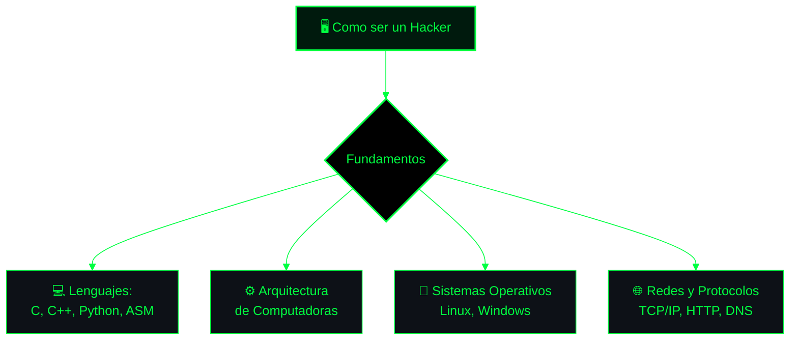
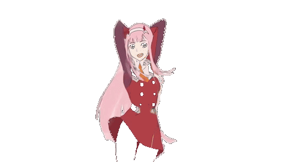
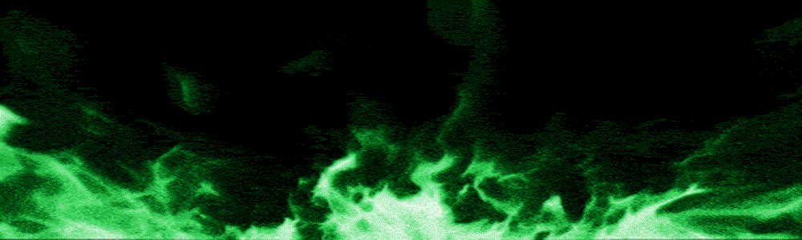

<!--
  DEMONHUNTER // PROFILE README
  DARK TERMINAL EDITION
  Palette: #0d1117 / #00ff41 / #001a0d
-->

 

 

 

 

```mermaid
%%{
  init: {
    'theme': 'base',
    'themeVariables': {
      'primaryColor': '#0d1117',
      'primaryTextColor': '#00ff41',
      'primaryBorderColor': '#00ff41',
      'lineColor': '#00ff41',
      'secondaryColor': '#001a0d',
      'tertiaryColor': '#000000',
      'background': '#0d1117',
      'fontFamily': 'monospace',
      'clusterBkg': '#0d1117',
      'clusterBorder': '#00ff41'
    },
    'flowchart': { 'curve': 'basis', 'nodeSpacing': 40, 'rankSpacing': 60 }
  }
}%%
flowchart TD
    A["🖥️ Como ser un Hacker"] --> B{"Fundamentos"}
    B --> B1["💻 Lenguajes:<br/>C, C++, Python, ASM"]
    B --> B2["⚙️ Arquitectura<br/>de Computadoras"]
    B --> B3["🐧 Sistemas Operativos<br/>Linux, Windows"]
    B --> B4["🌐 Redes y Protocolos<br/>TCP/IP, HTTP, DNS"]

    style A fill:#001a0d,stroke:#00ff41,stroke-width:2px,color:#00ff41
    style B fill:#000000,stroke:#00ff41,stroke-width:2px,color:#00ff41
    style B1 fill:#0d1117,stroke:#00ff41,color:#00ff41
    style B2 fill:#0d1117,stroke:#00ff41,color:#00ff41
    style B3 fill:#0d1117,stroke:#00ff41,color:#00ff41
    style B4 fill:#0d1117,stroke:#00ff41,color:#00ff41
```

  <a href="https://github.com/VictorH028">
    

 

 

